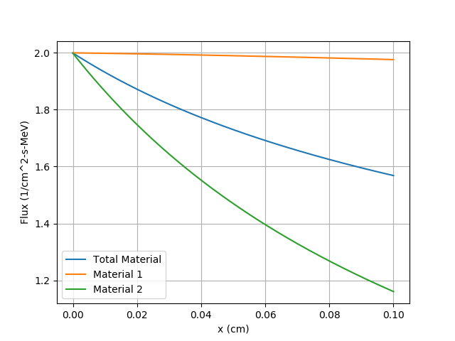
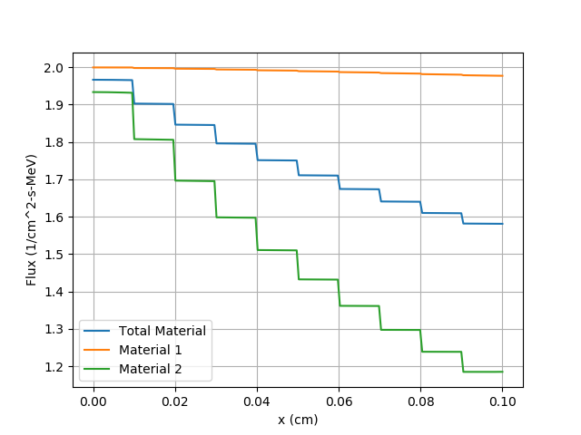
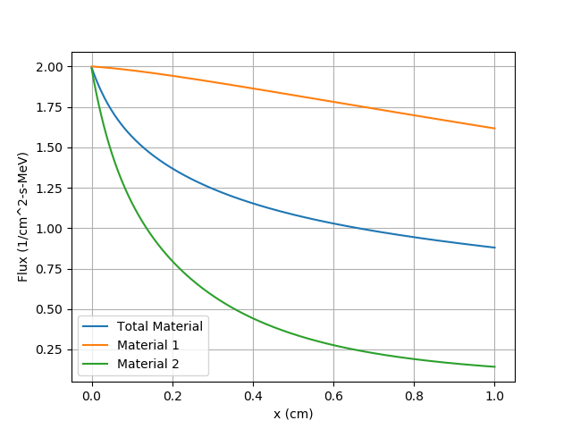
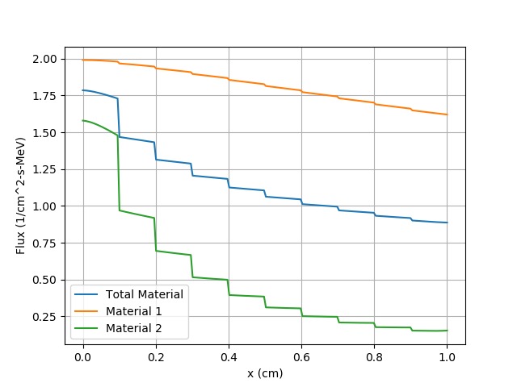
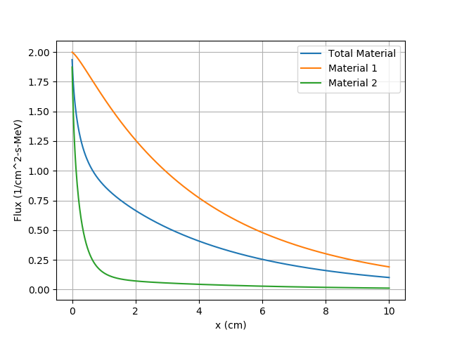
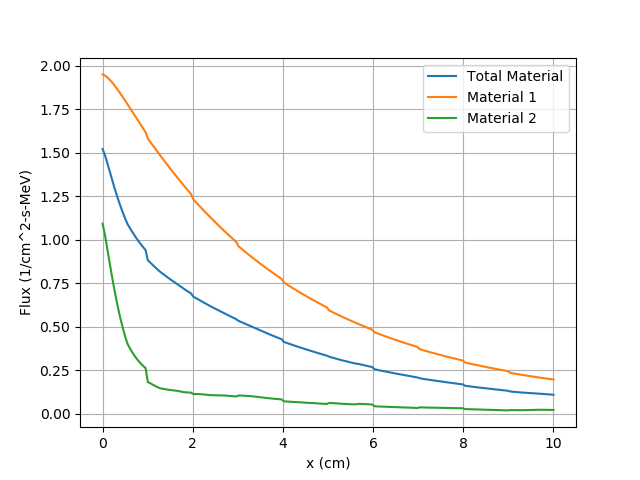

# Results of Absorber Test

## Parameters Given

Parameter | Material 1 | Material 2
--- | --- | ---
$\sigma_t$ | 2/101 | 200/101
$c$ | 0.00 | 0.00
$\lambda$ | 101/20 | 101/20

## Results

The exact values are those resulting from $1 \times 10^8$ realizations for all thicknesses (a pure absorber case is simple to calculate).

The model values are those resulting from a convergence to $1 \times 10^{-9}$ percent error between iterations.

### Thickness = 0.1

Parameter | Calculated Exact | Calculated Model
--- | --- | ---
Reflection | 0.0000000 | 0.0000000
Transmission | 0.8519521 | 0.8519832

#### Thickness = 0.1 Model Plot

#### Thickness = 0.1 Exact Plot

### Thickness = 1.0

Parameter | Calculated Exact | Calculated Model
--- | --- | ---
Reflection | 0.0000000 | 0.0000000
Transmission | 0.4751757 | 0.4756388

#### Thickness = 1.0 Model Plot

#### Thickness = 1.0 Exact Plot

### Thickness = 10.0

Alpha = 1.0000000

Parameter | Calculated Exact | Calculated Model | Alpha Closure
--- | --- | --- | ---
Reflection | 0.000000 | 0.0000000 | 0.0000000
Transmission | 0.0647808 | 0.0641339 | 0.0641339

#### Thickness = 10.0 Model Plot

### Thickness = 10.0 Exact Plot

